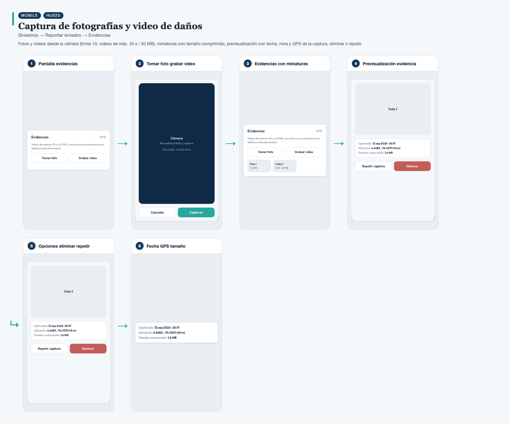
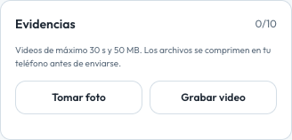
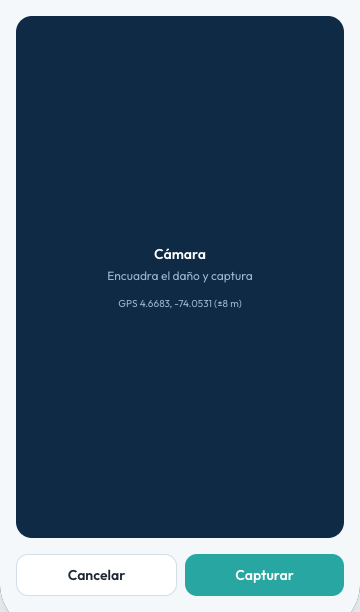
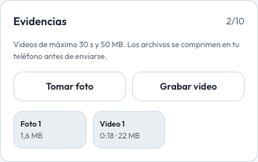
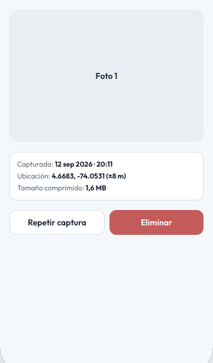
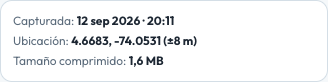

# HU020 – Captura de fotografías y video de daños

**Canal:** MOBILE · **Módulo:** Siniestros → Reportar siniestro → Evidencias

Fotos y videos desde la cámara (límite 10, videos de máx. 30 s / 50 MB), miniaturas con tamaño comprimido, previsualización con fecha, hora y GPS de la captura, eliminar o repetir.

## Flujo completo

## Paso a paso

### 1. Pantalla evidencias

⬇️

### 2. Tomar foto grabar video

⬇️

### 3. Evidencias con miniaturas

⬇️

### 4. Previsualización evidencia

⬇️

### 5. Opciones eliminar repetir

⬇️

### 6. Fecha GPS tamaño

---

[← Volver al índice de evidencias](../../README.md)
