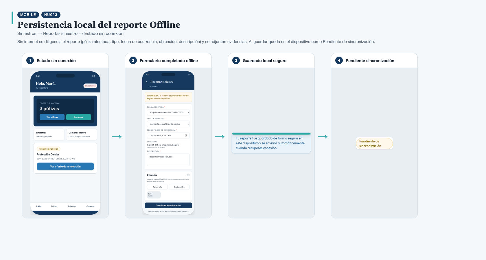
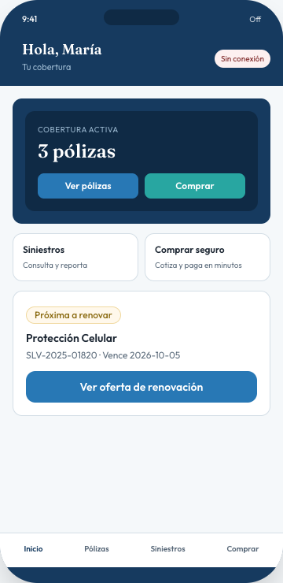
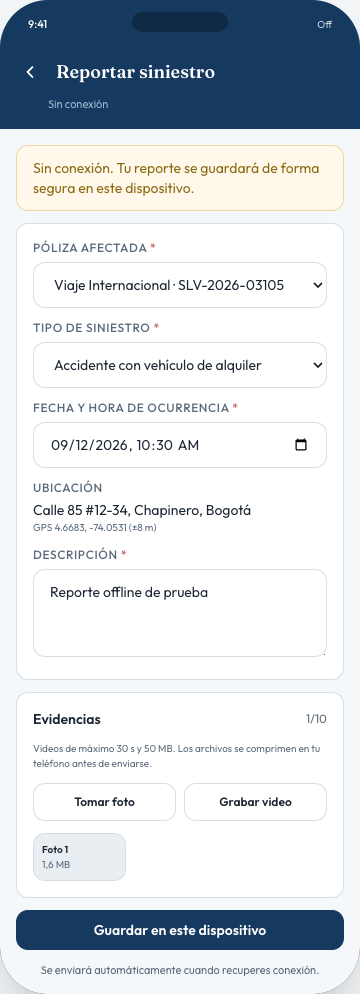

# HU023 – Persistencia local del reporte Offline

**Canal:** MOBILE · **Módulo:** Siniestros → Reportar siniestro → Estado sin conexión

Sin internet se diligencia el reporte (póliza afectada, tipo, fecha de ocurrencia, ubicación, descripción) y se adjuntan evidencias. Al guardar queda en el dispositivo como Pendiente de sincronización.

## Flujo completo

## Paso a paso

### 1. Estado sin conexión

⬇️

### 2. Formulario completado offline

⬇️

### 3. Guardado local seguro

⬇️

### 4. Pendiente sincronización

---

[← Volver al índice de evidencias](../../README.md)
