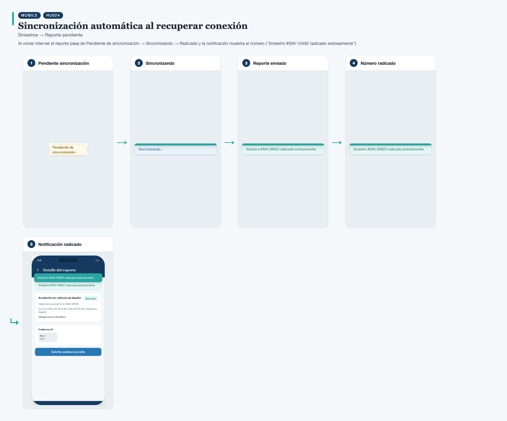
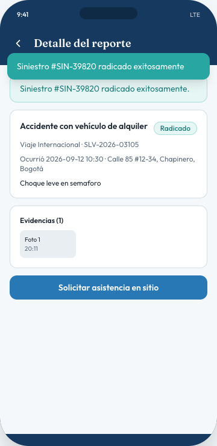

# HU024 – Sincronización automática al recuperar conexión

**Canal:** MOBILE · **Módulo:** Siniestros → Reporte pendiente

Al volver internet el reporte pasa de Pendiente de sincronización → Sincronizando → Radicado y la notificación muestra el número ("Siniestro #SIN-10492 radicado exitosamente").

## Flujo completo

## Paso a paso

### 1. Pendiente sincronización

⬇️

### 2. Sincronizando

⬇️

### 3. Reporte enviado

⬇️

### 4. Número radicado

⬇️

### 5. Notificación radicado

---

[← Volver al índice de evidencias](../../README.md)
