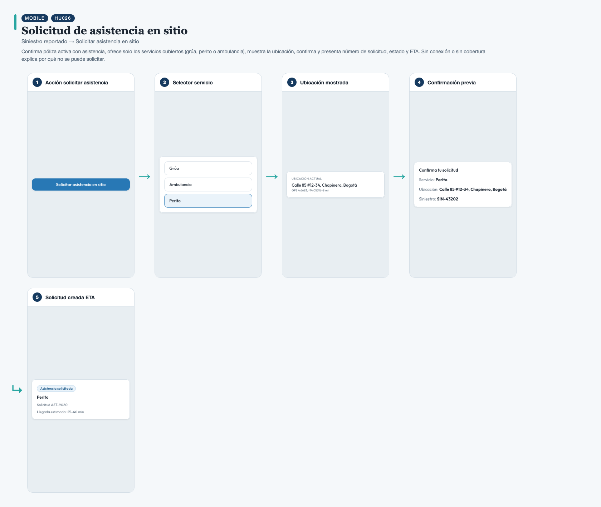
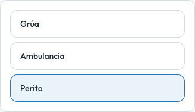
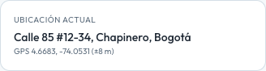
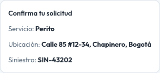
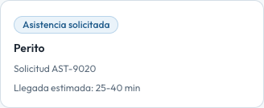

# HU026 – Solicitud de asistencia en sitio

**Canal:** MOBILE · **Módulo:** Siniestro reportado → Solicitar asistencia en sitio

Confirma póliza activa con asistencia, ofrece solo los servicios cubiertos (grúa, perito o ambulancia), muestra la ubicación, confirma y presenta número de solicitud, estado y ETA. Sin conexión o sin cobertura explica por qué no se puede solicitar.

## Flujo completo

## Paso a paso

### 1. Acción solicitar asistencia

⬇️

### 2. Selector servicio

⬇️

### 3. Ubicación mostrada

⬇️

### 4. Confirmación previa

⬇️

### 5. Solicitud creada ETA

---

[← Volver al índice de evidencias](../../README.md)
