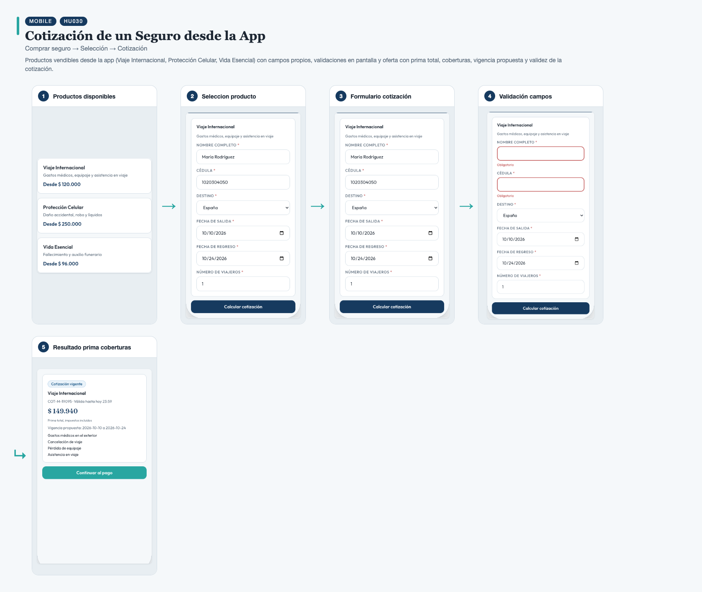
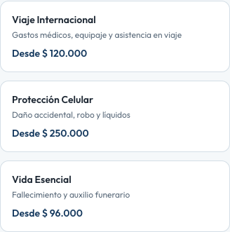
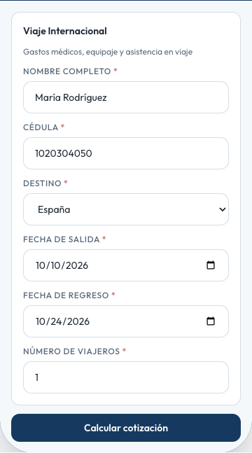
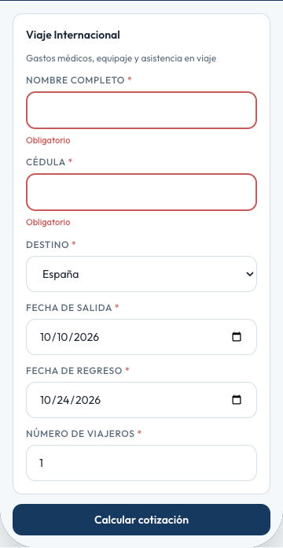
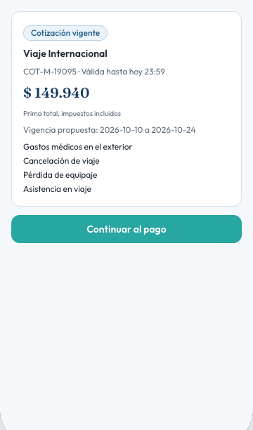

# HU030 – Cotización de un Seguro desde la App

**Canal:** MOBILE · **Módulo:** Comprar seguro → Selección → Cotización

Productos vendibles desde la app (Viaje Internacional, Protección Celular, Vida Esencial) con campos propios, validaciones en pantalla y oferta con prima total, coberturas, vigencia propuesta y validez de la cotización.

## Flujo completo

## Paso a paso

### 1. Productos disponibles

⬇️

### 2. Seleccion producto

⬇️

### 3. Formulario cotización

⬇️

### 4. Validación campos

⬇️

### 5. Resultado prima coberturas

---

[← Volver al índice de evidencias](../../README.md)
