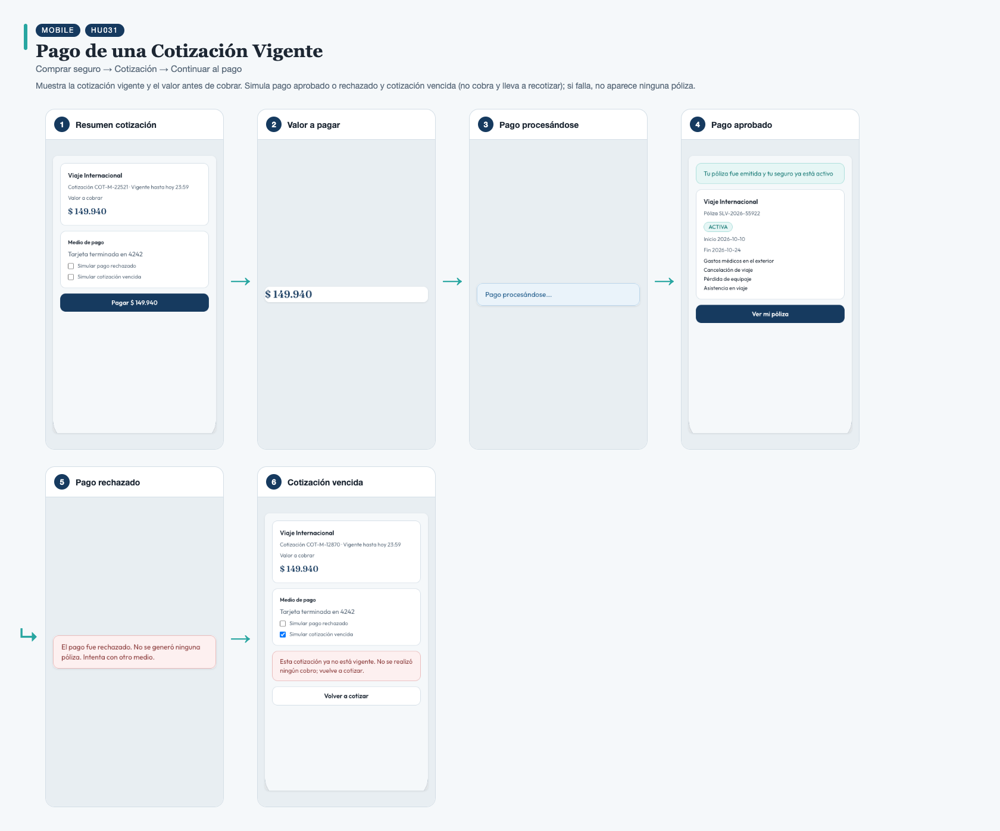
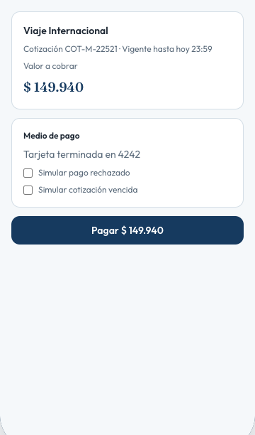
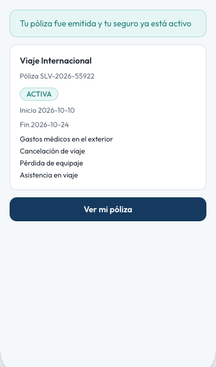
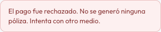
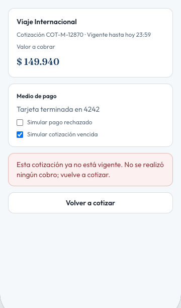

# HU031 – Pago de una Cotización Vigente

**Canal:** MOBILE · **Módulo:** Comprar seguro → Cotización → Continuar al pago

Muestra la cotización vigente y el valor antes de cobrar. Simula pago aprobado o rechazado y cotización vencida (no cobra y lleva a recotizar); si falla, no aparece ninguna póliza.

## Flujo completo

## Paso a paso

### 1. Resumen cotización

⬇️

### 2. Valor a pagar

⬇️

### 3. Pago procesándose

⬇️

### 4. Pago aprobado

⬇️

### 5. Pago rechazado

⬇️

### 6. Cotización vencida

---

[← Volver al índice de evidencias](../../README.md)
