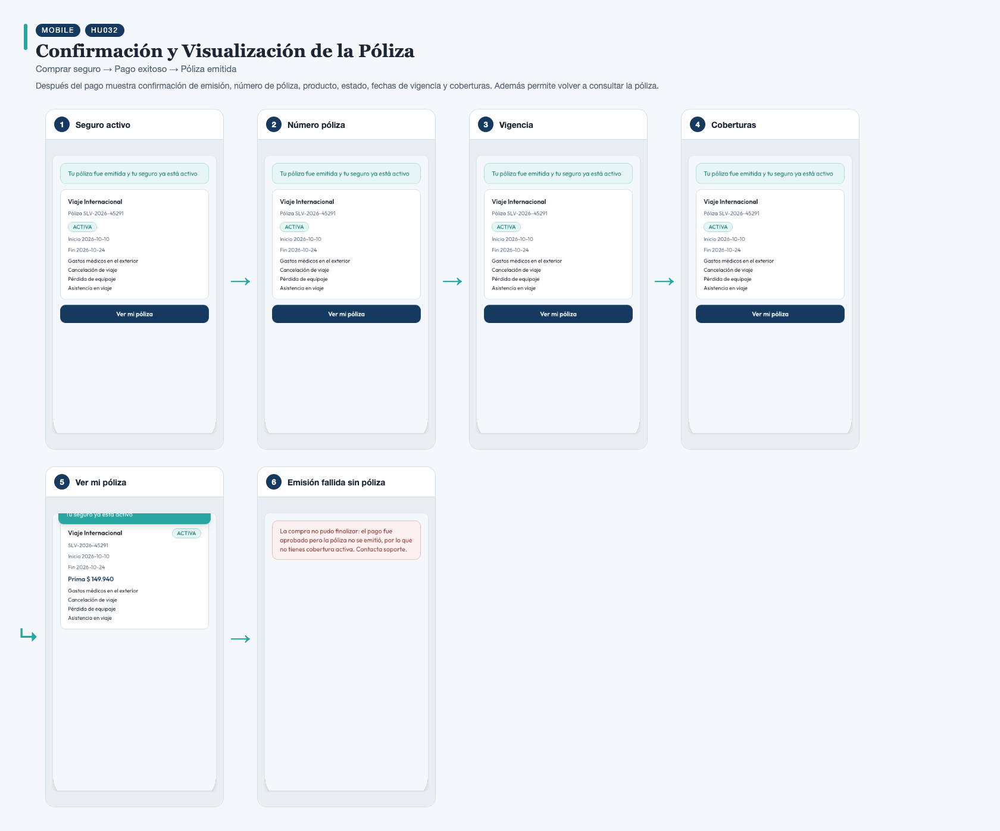
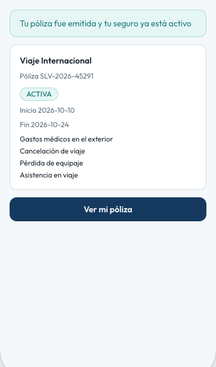
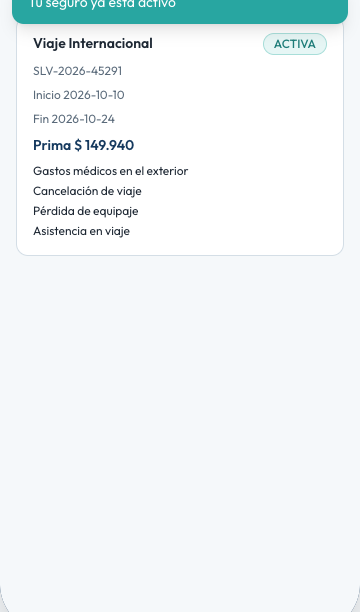
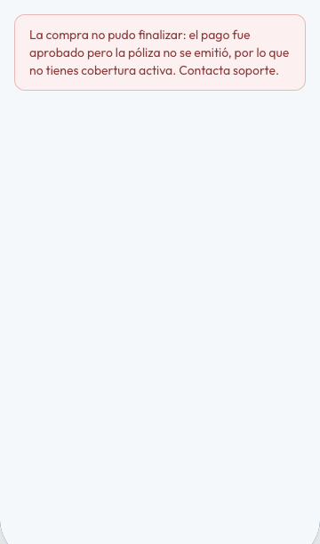

# HU032 – Confirmación y Visualización de la Póliza

**Canal:** MOBILE · **Módulo:** Comprar seguro → Pago exitoso → Póliza emitida

Después del pago muestra confirmación de emisión, número de póliza, producto, estado, fechas de vigencia y coberturas. Además permite volver a consultar la póliza.

## Flujo completo

## Paso a paso

### 1. Seguro activo

⬇️

### 2. Número póliza

⬇️

### 3. Vigencia

⬇️

### 4. Coberturas

⬇️

### 5. Ver mi póliza

⬇️

### 6. Emisión fallida sin póliza

---

[← Volver al índice de evidencias](../../README.md)
