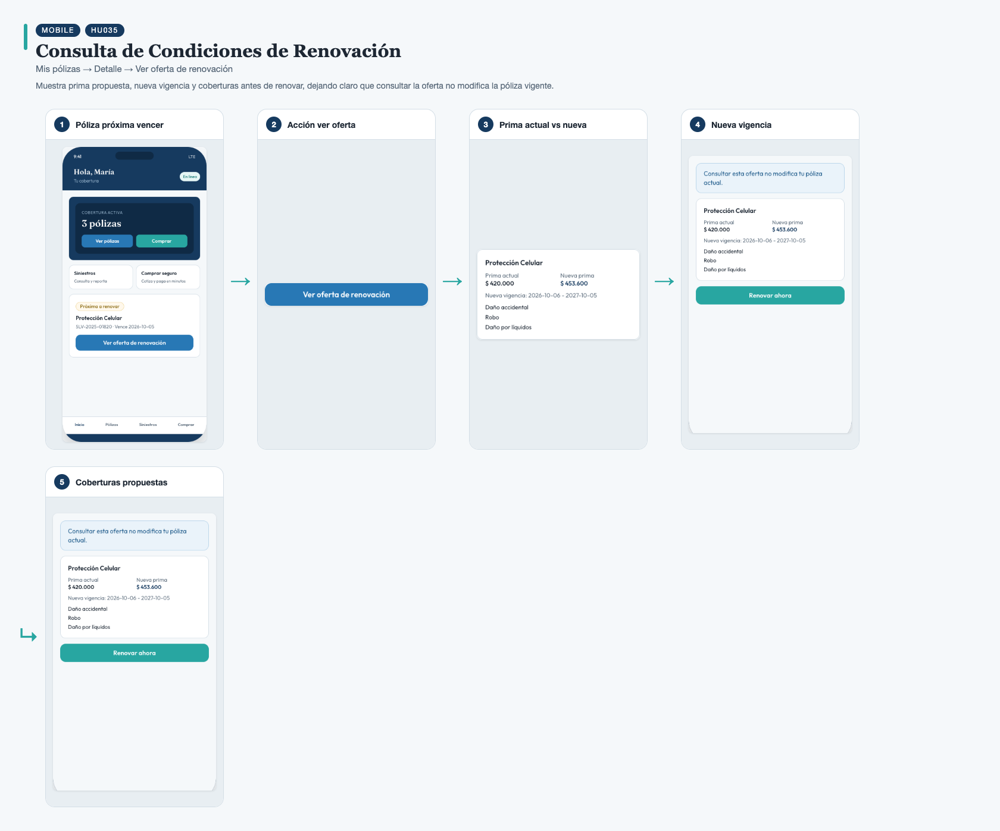
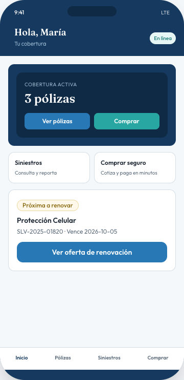
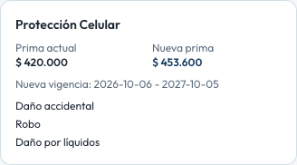
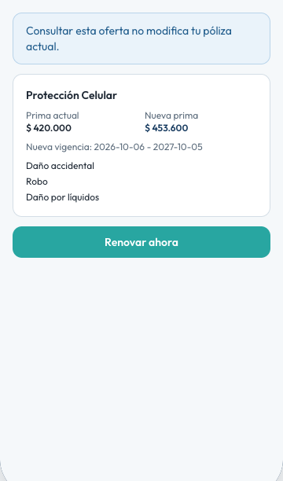

# HU035 – Consulta de Condiciones de Renovación

**Canal:** MOBILE · **Módulo:** Mis pólizas → Detalle → Ver oferta de renovación

Muestra prima propuesta, nueva vigencia y coberturas antes de renovar, dejando claro que consultar la oferta no modifica la póliza vigente.

## Flujo completo

## Paso a paso

### 1. Póliza próxima vencer

⬇️

### 2. Acción ver oferta

⬇️

### 3. Prima actual vs nueva

⬇️

### 4. Nueva vigencia

⬇️

### 5. Coberturas propuestas

---

[← Volver al índice de evidencias](../../README.md)
