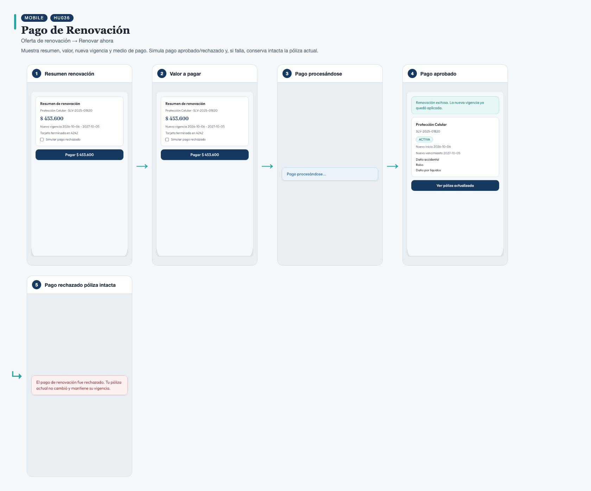
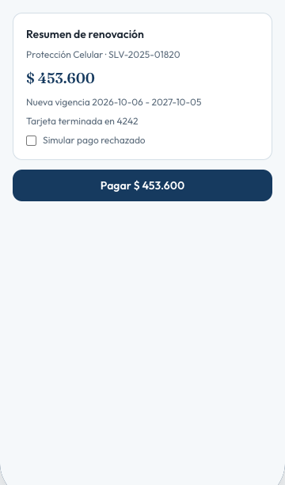
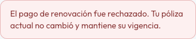

# HU036 – Pago de Renovación

**Canal:** MOBILE · **Módulo:** Oferta de renovación → Renovar ahora

Muestra resumen, valor, nueva vigencia y medio de pago. Simula pago aprobado/rechazado y, si falla, conserva intacta la póliza actual.

## Flujo completo

## Paso a paso

### 1. Resumen renovación

⬇️

### 2. Valor a pagar

⬇️

### 3. Pago procesándose

⬇️

### 4. Pago aprobado

⬇️

### 5. Pago rechazado póliza intacta

---

[← Volver al índice de evidencias](../../README.md)
