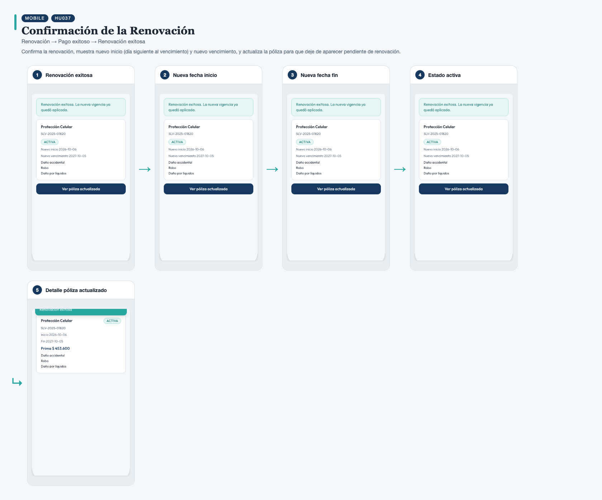
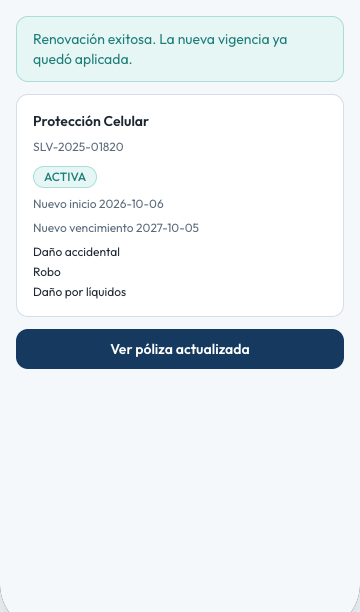
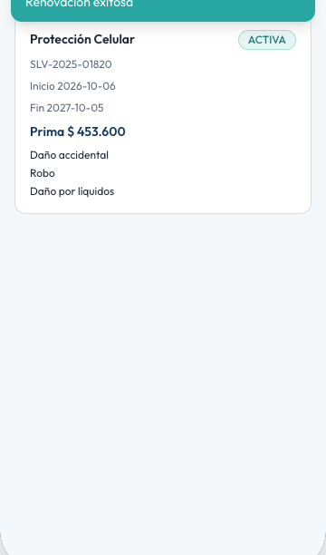

# HU037 – Confirmación de la Renovación

**Canal:** MOBILE · **Módulo:** Renovación → Pago exitoso → Renovación exitosa

Confirma la renovación, muestra nuevo inicio (día siguiente al vencimiento) y nuevo vencimiento, y actualiza la póliza para que deje de aparecer pendiente de renovación.

## Flujo completo

## Paso a paso

### 1. Renovación exitosa

⬇️

### 2. Nueva fecha inicio

⬇️

### 3. Nueva fecha fin

⬇️

### 4. Estado activa

⬇️

### 5. Detalle póliza actualizado

---

[← Volver al índice de evidencias](../../README.md)
