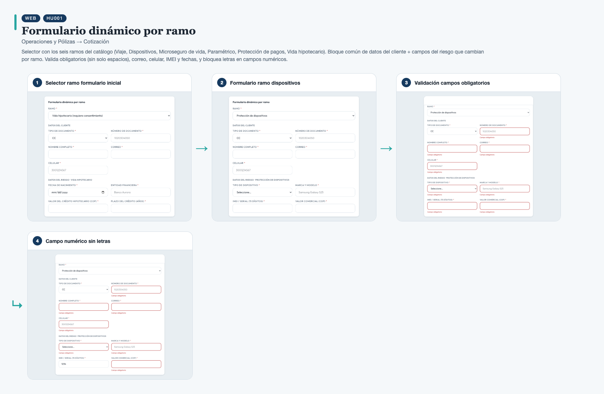
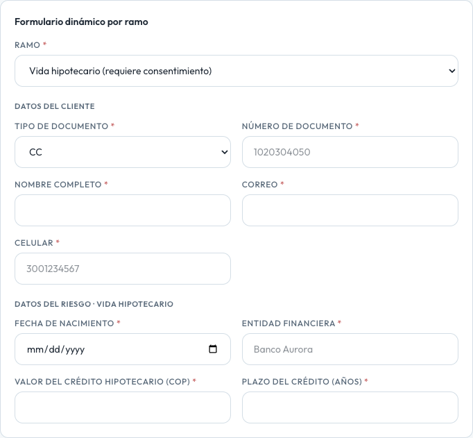
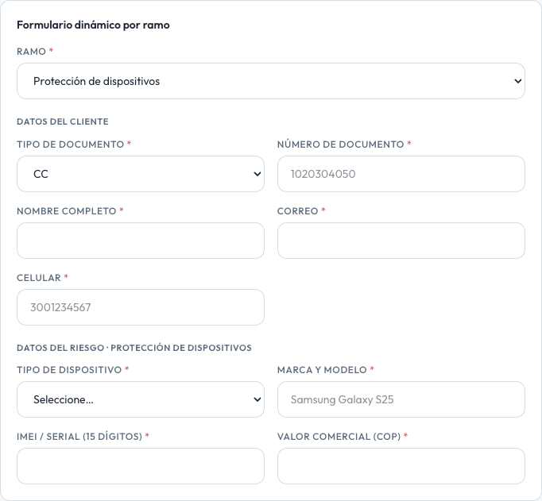
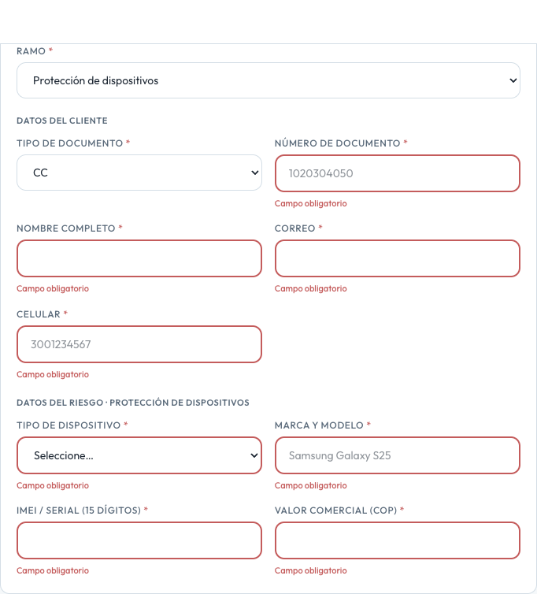
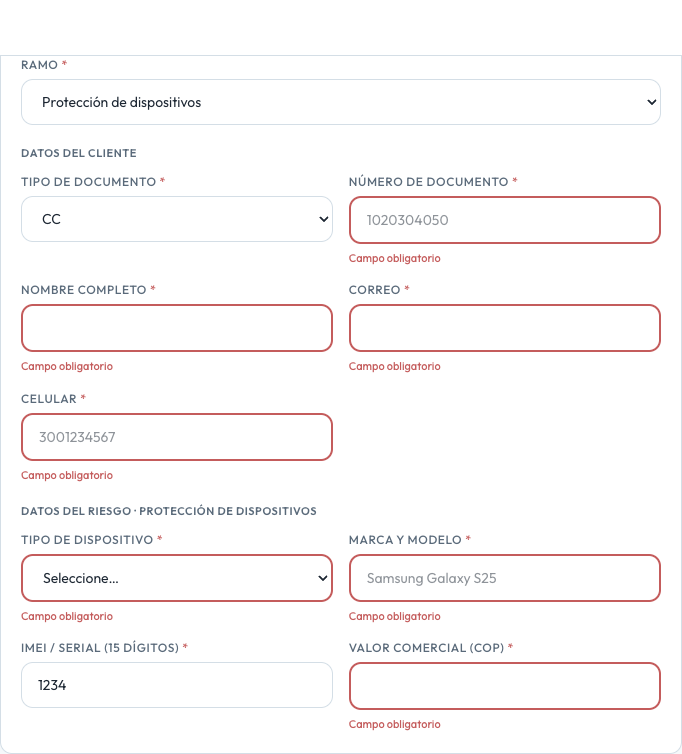

# HU001 – Formulario dinámico por ramo

**Canal:** WEB · **Módulo:** Operaciones y Pólizas → Cotización

Selector con los seis ramos del catálogo (Viaje, Dispositivos, Microseguro de vida, Paramétrico, Protección de pagos, Vida hipotecario). Bloque común de datos del cliente + campos del riesgo que cambian por ramo. Valida obligatorios (sin solo espacios), correo, celular, IMEI y fechas, y bloquea letras en campos numéricos.

## Flujo completo

## Paso a paso

### 1. Selector ramo formulario inicial

⬇️

### 2. Formulario ramo dispositivos

⬇️

### 3. Validación campos obligatorios

⬇️

### 4. Campo numérico sin letras

---

[← Volver al índice de evidencias](../../README.md)
