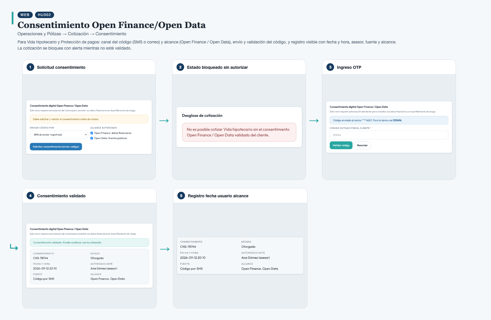
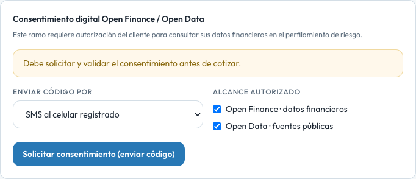
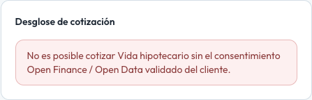
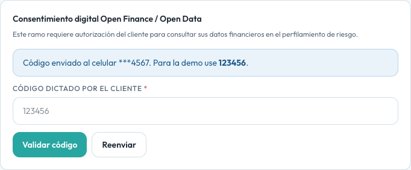
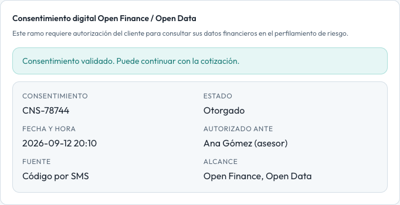
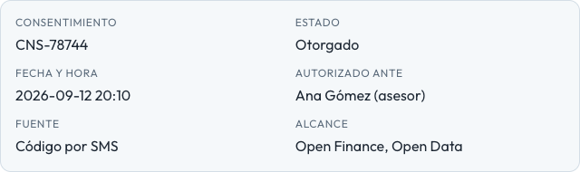

# HU002 – Consentimiento Open Finance/Open Data

**Canal:** WEB · **Módulo:** Operaciones y Pólizas → Cotización → Consentimiento

Para Vida hipotecario y Protección de pagos: canal del código (SMS o correo) y alcance (Open Finance / Open Data), envío y validación del código, y registro visible con fecha y hora, asesor, fuente y alcance. La cotización se bloquea con alerta mientras no esté validado.

## Flujo completo

## Paso a paso

### 1. Solicitud consentimiento

⬇️

### 2. Estado bloqueado sin autorizar

⬇️

### 3. Ingreso OTP

⬇️

### 4. Consentimiento validado

⬇️

### 5. Registro fecha usuario alcance

---

[← Volver al índice de evidencias](../../README.md)
