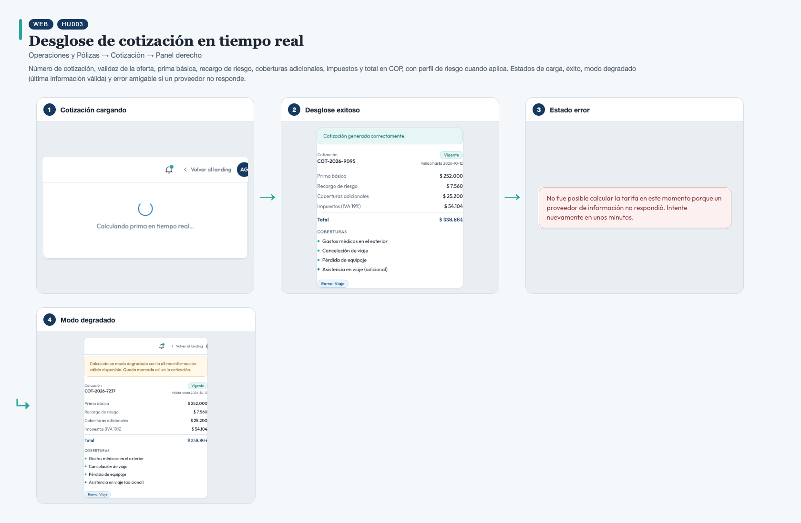
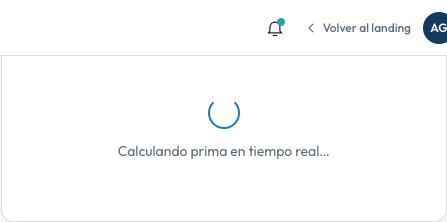
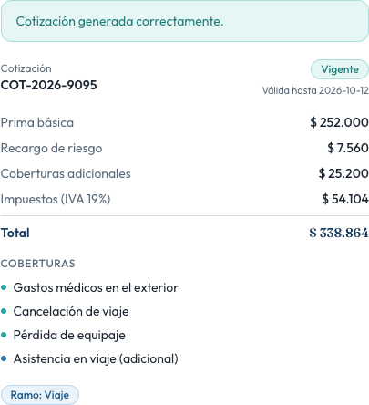
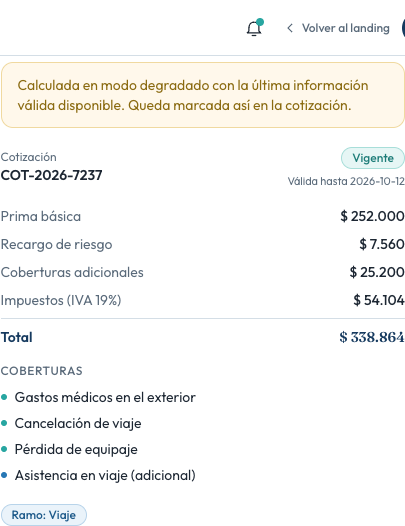

# HU003 – Desglose de cotización en tiempo real

**Canal:** WEB · **Módulo:** Operaciones y Pólizas → Cotización → Panel derecho

Número de cotización, validez de la oferta, prima básica, recargo de riesgo, coberturas adicionales, impuestos y total en COP, con perfil de riesgo cuando aplica. Estados de carga, éxito, modo degradado (última información válida) y error amigable si un proveedor no responde.

## Flujo completo

## Paso a paso

### 1. Cotización cargando

⬇️

### 2. Desglose exitoso

⬇️

### 3. Estado error

⬇️

### 4. Modo degradado

---

[← Volver al índice de evidencias](../../README.md)
