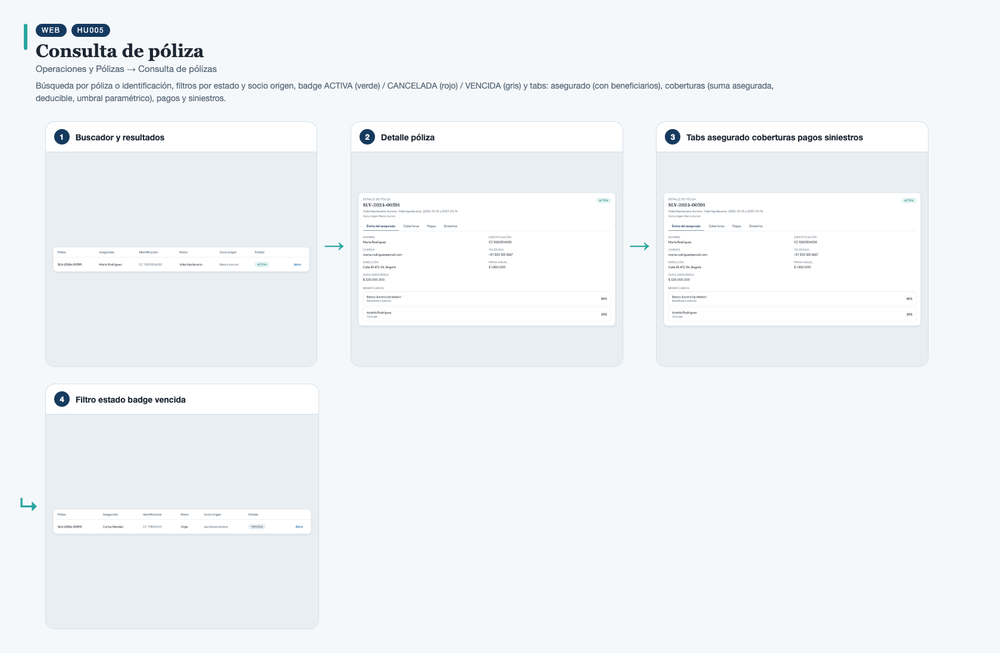
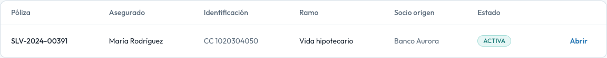
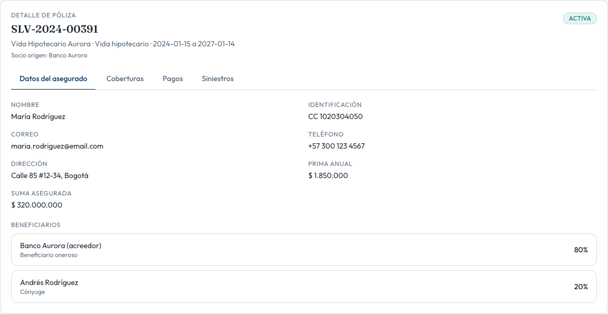
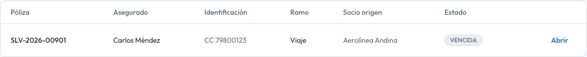

# HU005 – Consulta de póliza

**Canal:** WEB · **Módulo:** Operaciones y Pólizas → Consulta de pólizas

Búsqueda por póliza o identificación, filtros por estado y socio origen, badge ACTIVA (verde) / CANCELADA (rojo) / VENCIDA (gris) y tabs: asegurado (con beneficiarios), coberturas (suma asegurada, deducible, umbral paramétrico), pagos y siniestros.

## Flujo completo

## Paso a paso

### 1. Buscador y resultados

⬇️

### 2. Detalle póliza

⬇️

### 3. Tabs asegurado coberturas pagos siniestros

⬇️

### 4. Filtro estado badge vencida

---

[← Volver al índice de evidencias](../../README.md)
