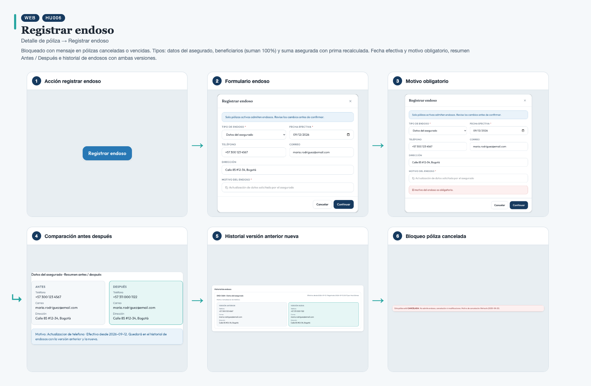
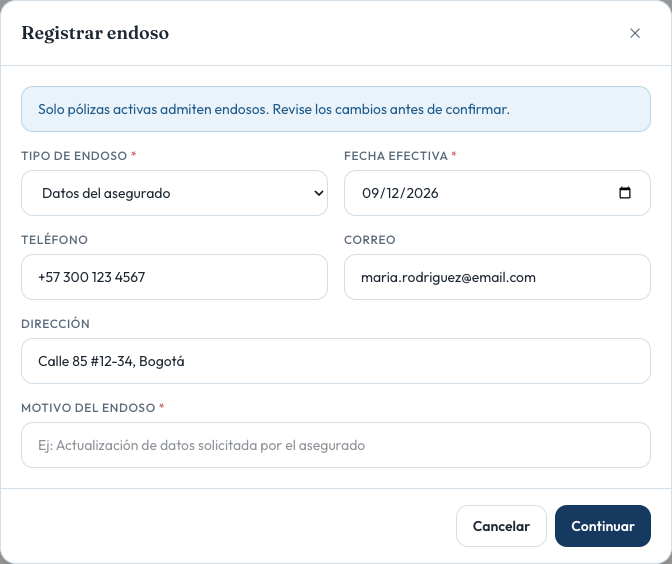
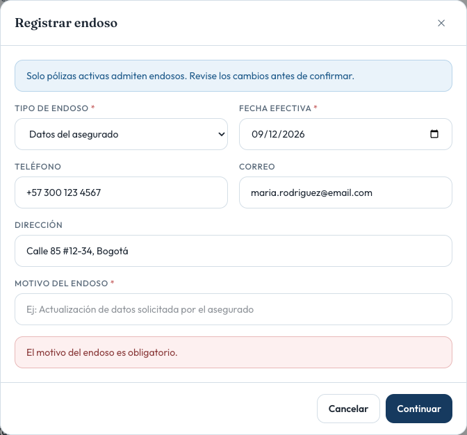
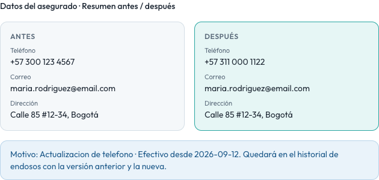
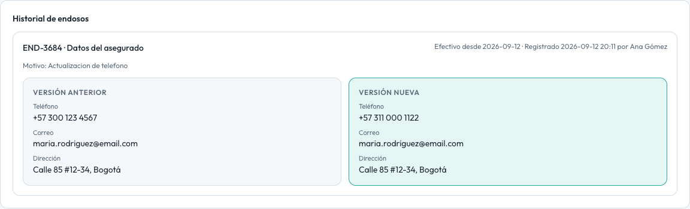

# HU006 – Registrar endoso

**Canal:** WEB · **Módulo:** Detalle de póliza → Registrar endoso

Bloqueado con mensaje en pólizas canceladas o vencidas. Tipos: datos del asegurado, beneficiarios (suman 100%) y suma asegurada con prima recalculada. Fecha efectiva y motivo obligatorio, resumen Antes / Después e historial de endosos con ambas versiones.

## Flujo completo

## Paso a paso

### 1. Acción registrar endoso

⬇️

### 2. Formulario endoso

⬇️

### 3. Motivo obligatorio

⬇️

### 4. Comparación antes después

⬇️

### 5. Historial versión anterior nueva

⬇️

### 6. Bloqueo póliza cancelada

---

[← Volver al índice de evidencias](../../README.md)
