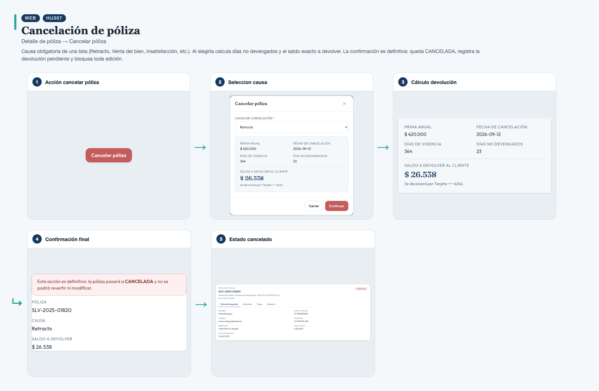
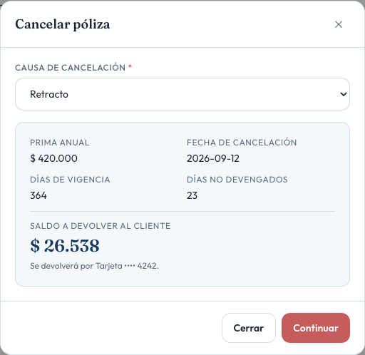
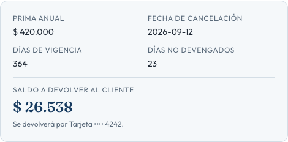
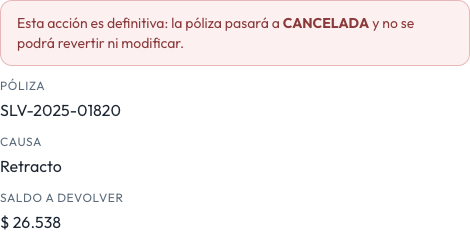
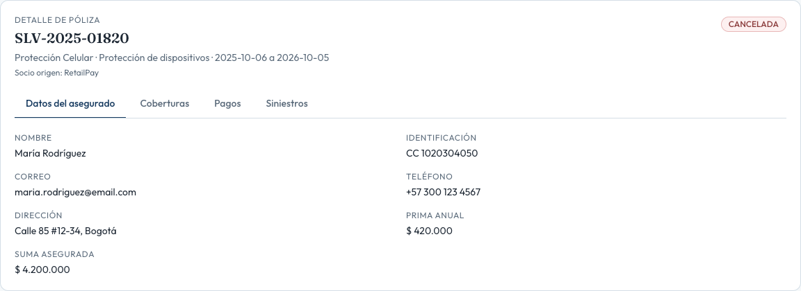

# HU007 – Cancelación de póliza

**Canal:** WEB · **Módulo:** Detalle de póliza → Cancelar póliza

Causa obligatoria de una lista (Retracto, Venta del bien, Insatisfacción, etc.). Al elegirla calcula días no devengados y el saldo exacto a devolver. La confirmación es definitiva: queda CANCELADA, registra la devolución pendiente y bloquea toda edición.

## Flujo completo

## Paso a paso

### 1. Acción cancelar póliza

⬇️

### 2. Seleccion causa

⬇️

### 3. Cálculo devolución

⬇️

### 4. Confirmación final

⬇️

### 5. Estado cancelado

---

[← Volver al índice de evidencias](../../README.md)
