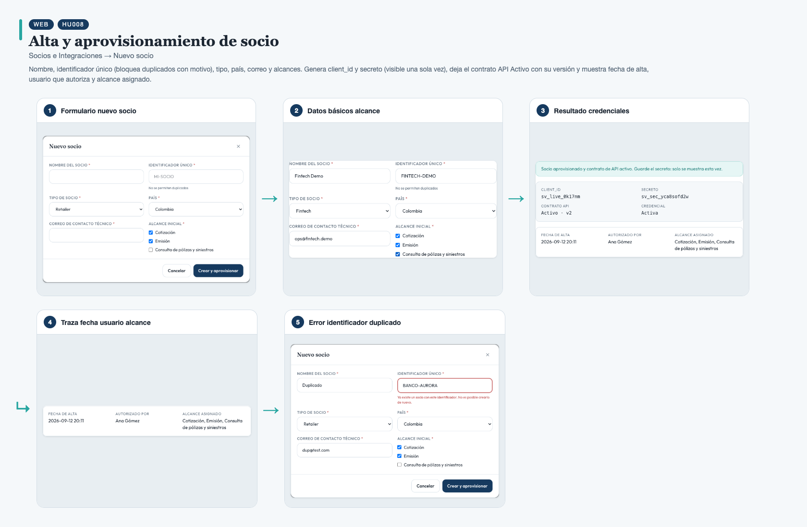
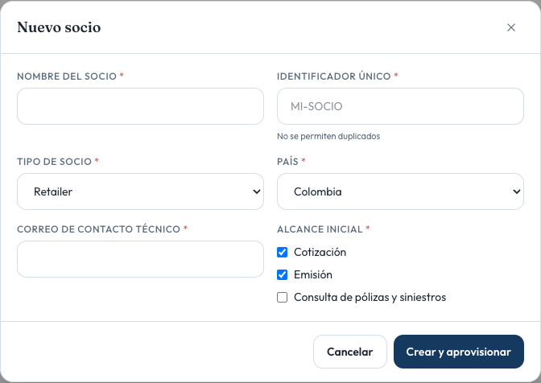
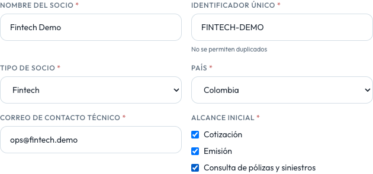
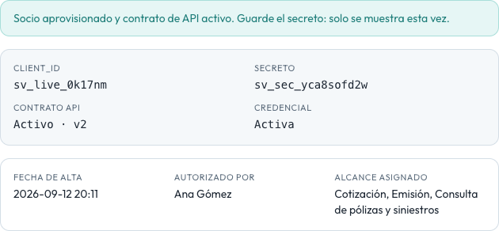
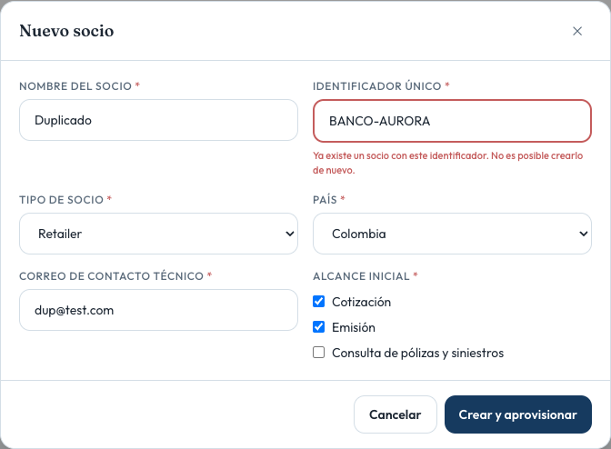

# HU008 – Alta y aprovisionamiento de socio

**Canal:** WEB · **Módulo:** Socios e Integraciones → Nuevo socio

Nombre, identificador único (bloquea duplicados con motivo), tipo, país, correo y alcances. Genera client_id y secreto (visible una sola vez), deja el contrato API Activo con su versión y muestra fecha de alta, usuario que autoriza y alcance asignado.

## Flujo completo

## Paso a paso

### 1. Formulario nuevo socio

⬇️

### 2. Datos básicos alcance

⬇️

### 3. Resultado credenciales

⬇️

### 4. Traza fecha usuario alcance

⬇️

### 5. Error identificador duplicado

---

[← Volver al índice de evidencias](../../README.md)
