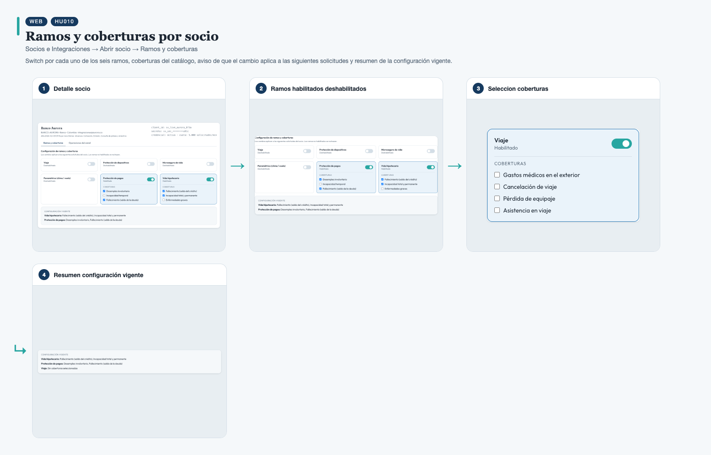
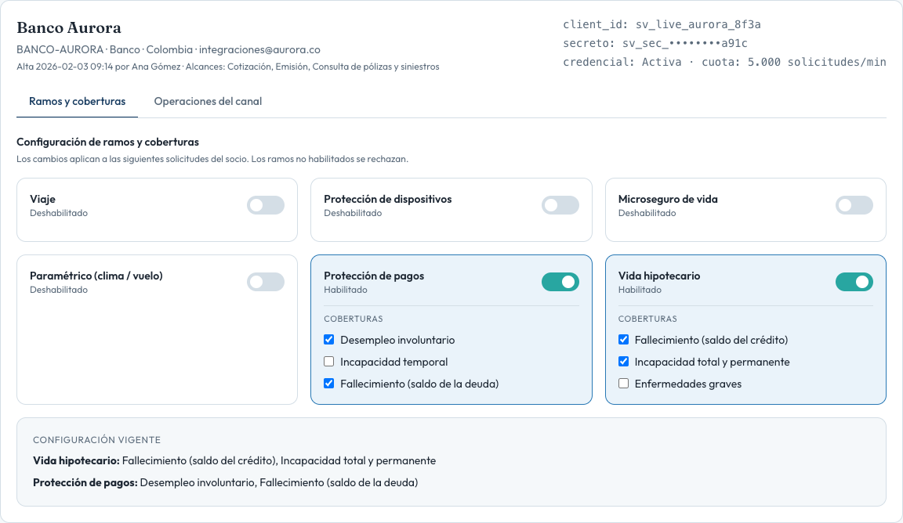
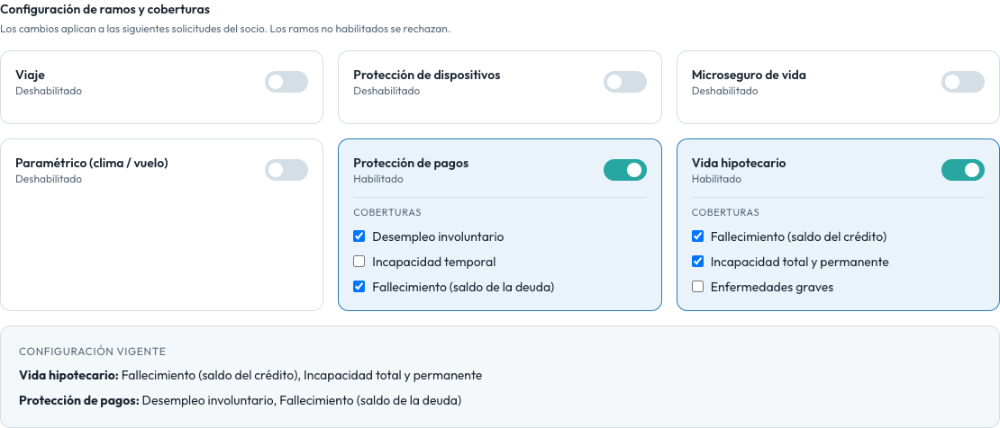
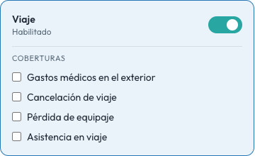
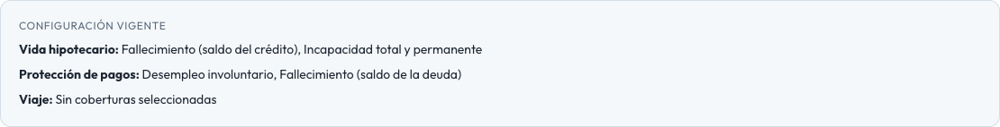

# HU010 – Ramos y coberturas por socio

**Canal:** WEB · **Módulo:** Socios e Integraciones → Abrir socio → Ramos y coberturas

Switch por cada uno de los seis ramos, coberturas del catálogo, aviso de que el cambio aplica a las siguientes solicitudes y resumen de la configuración vigente.

## Flujo completo

## Paso a paso

### 1. Detalle socio

⬇️

### 2. Ramos habilitados deshabilitados

⬇️

### 3. Seleccion coberturas

⬇️

### 4. Resumen configuración vigente

---

[← Volver al índice de evidencias](../../README.md)
