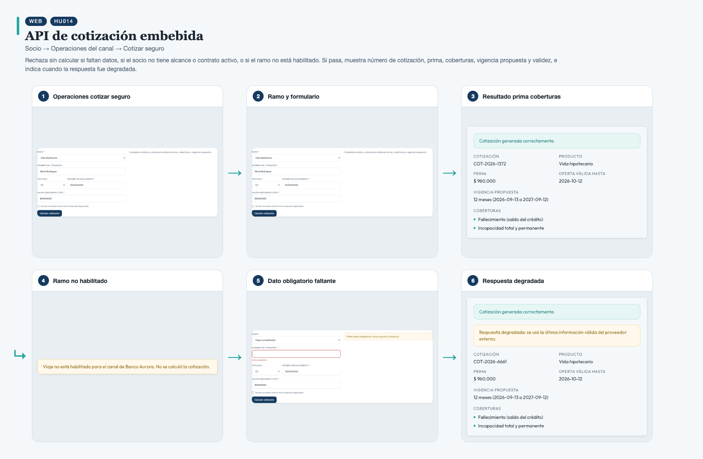
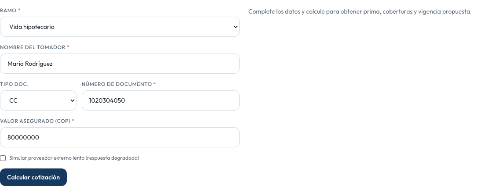
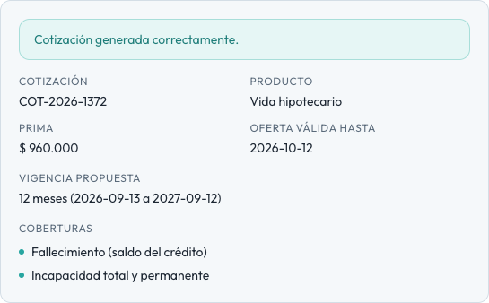
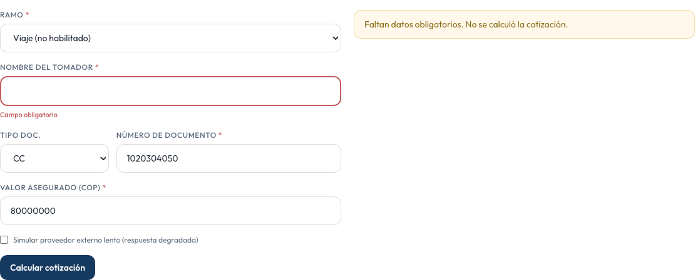
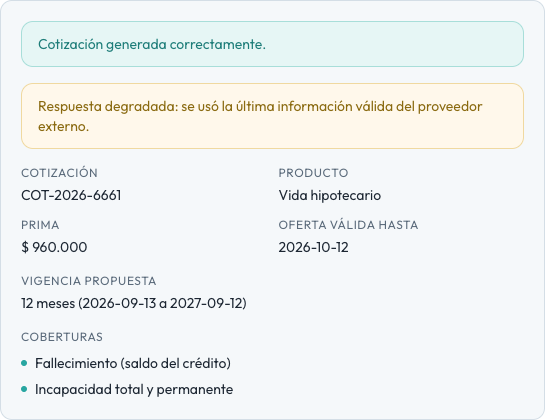

# HU014 – API de cotización embebida

**Canal:** WEB · **Módulo:** Socio → Operaciones del canal → Cotizar seguro

Rechaza sin calcular si faltan datos, si el socio no tiene alcance o contrato activo, o si el ramo no está habilitado. Si pasa, muestra número de cotización, prima, coberturas, vigencia propuesta y validez, e indica cuando la respuesta fue degradada.

## Flujo completo

## Paso a paso

### 1. Operaciones cotizar seguro

⬇️

### 2. Ramo y formulario

⬇️

### 3. Resultado prima coberturas

⬇️

### 4. Ramo no habilitado

⬇️

### 5. Dato obligatorio faltante

⬇️

### 6. Respuesta degradada

---

[← Volver al índice de evidencias](../../README.md)
