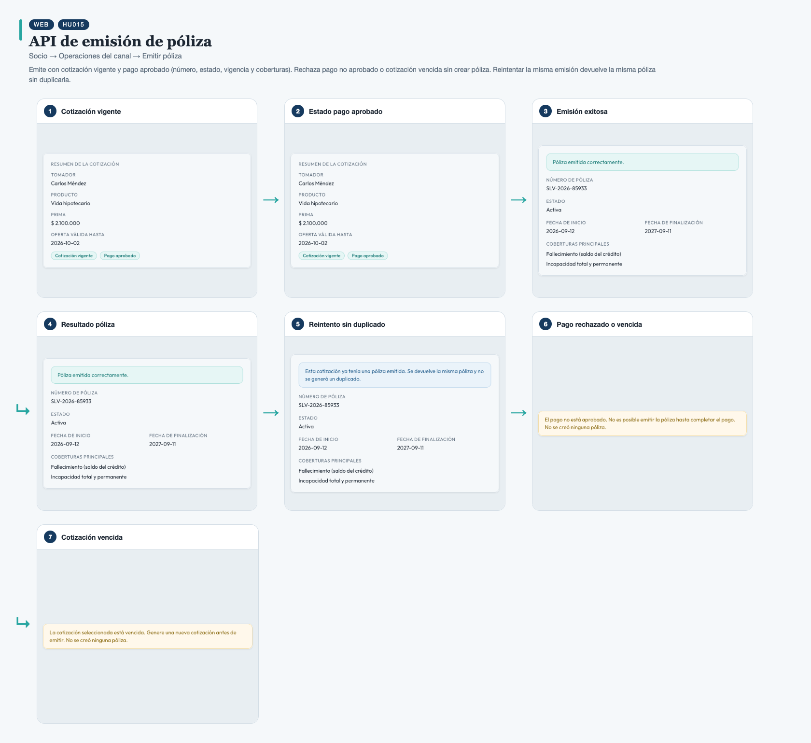
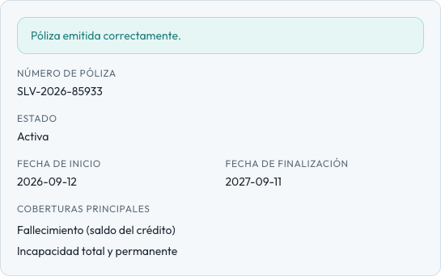
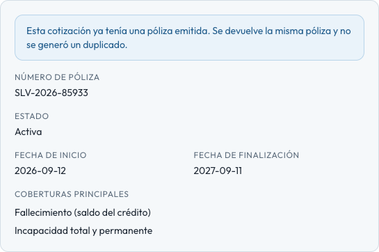

# HU015 – API de emisión de póliza

**Canal:** WEB · **Módulo:** Socio → Operaciones del canal → Emitir póliza

Emite con cotización vigente y pago aprobado (número, estado, vigencia y coberturas). Rechaza pago no aprobado o cotización vencida sin crear póliza. Reintentar la misma emisión devuelve la misma póliza sin duplicarla.

## Flujo completo

## Paso a paso

### 1. Cotización vigente

⬇️

### 2. Estado pago aprobado

⬇️

### 3. Emisión exitosa

⬇️

### 4. Resultado póliza

⬇️

### 5. Reintento sin duplicado

⬇️

### 6. Pago rechazado o vencida

⬇️

### 7. Cotización vencida

---

[← Volver al índice de evidencias](../../README.md)
