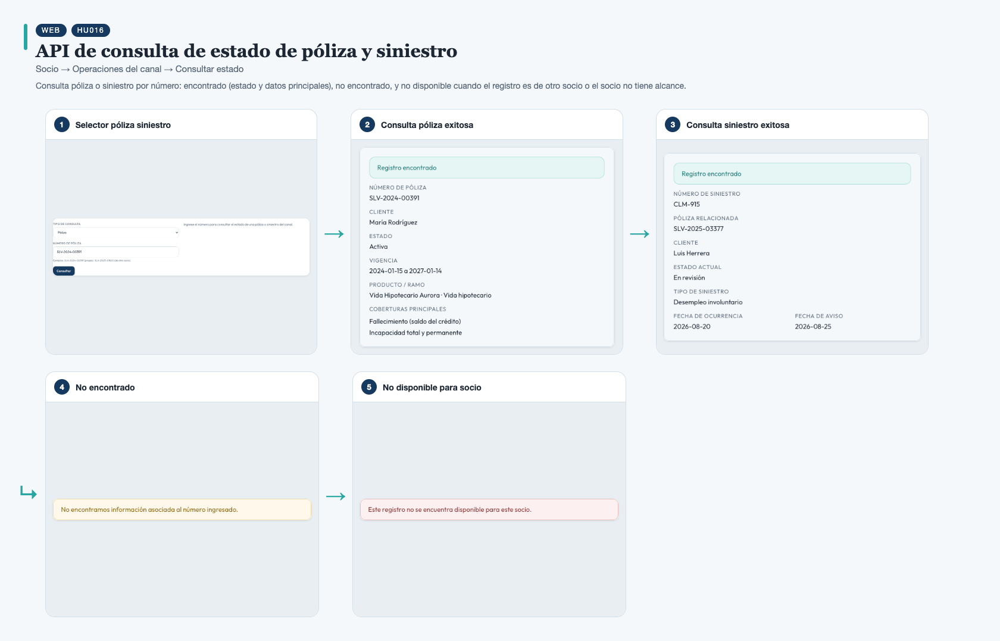
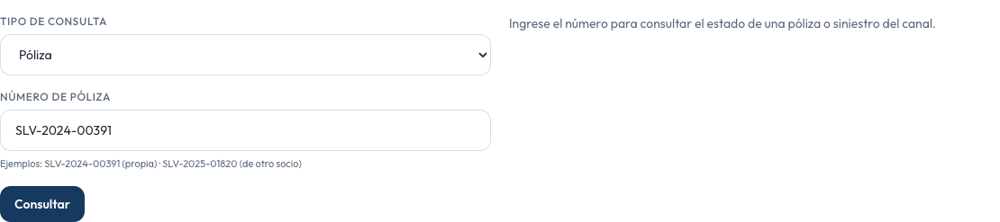
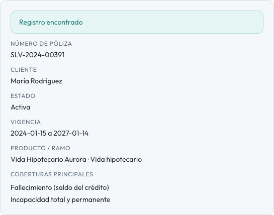
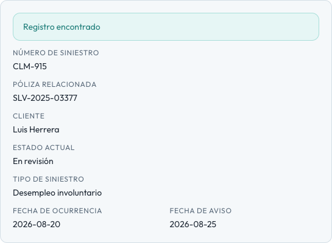

# HU016 – API de consulta de estado de póliza y siniestro

**Canal:** WEB · **Módulo:** Socio → Operaciones del canal → Consultar estado

Consulta póliza o siniestro por número: encontrado (estado y datos principales), no encontrado, y no disponible cuando el registro es de otro socio o el socio no tiene alcance.

## Flujo completo

## Paso a paso

### 1. Selector póliza siniestro

⬇️

### 2. Consulta póliza exitosa

⬇️

### 3. Consulta siniestro exitosa

⬇️

### 4. No encontrado

⬇️

### 5. No disponible para socio

---

[← Volver al índice de evidencias](../../README.md)
